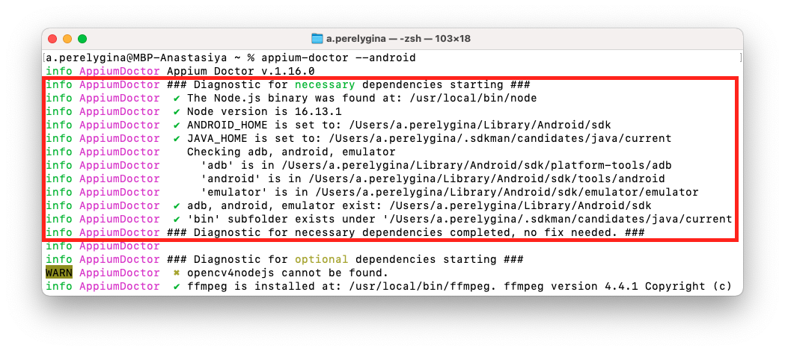
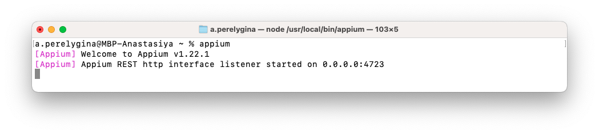
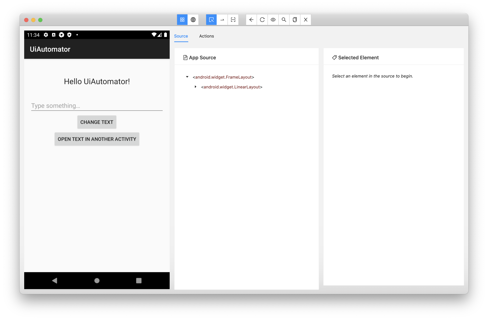

# Домашнее задание к занятию "2.4 Appium. Кроссплатформенная мобильная автоматизация тестирования"

Любые вопросы по решению задач задавайте в чате учебной группы.

---

## Задача 1. Настройка окружения для работы с Appium

1. Установите [Node.js](https://nodejs.org/en/download/).
2. Через терминал, используя менеджер пакетов npm, установите **appium** и **appium-doctor**. При появлении ошибок попробуйте выполнить команды от имени администратора.
```bash
npm install -g appium
npm install -g appium-doctor
```
3. Запустите appium-doctor, выполнив в терминале команду, и посмотрите, каких компонентов не хватает для автоматизации android.
```bash
appium-doctor --android
```
4. Если в системной переменной **PATH** не хватает значений *JAVA_HOME* и *ANDROID_HOME*, то задайте их. В зависимости от ОС это делается по-разному. [Инструкция](https://www.baeldung.com/java-home-on-windows-7-8-10-mac-os-x-linux) по установке переменных окружения для разных ОС.

5. Снова запустите appium-doctor и убедитесь, что в блоке **necessary** возле всех пунктов стоят зелёные галочки (см. скрин ниже). Если ничего не изменилось, то попробуйте выполнить команду в новом окне терминала или перезагрузить компьютер.


6. Установите последнюю версию [Appium Inspector](https://github.com/appium/appium-inspector/releases).

7. Запустите в терминале appium-сервер.
```bash
appium
```


8. Подключите реальный android-девайс к компьютеру и включите отладку по USB или запустите эмулятор.

9. Постройте [приложение из лекции 2.2](https://github.com/netology-code/mqa-homeworks/tree/main/2.2%20UI%20Automator/sample) и запомните путь к apk файлу.

10. Подключитесь к устройству через Appium Inspector. В значении параметра *app* укажите путь к apk файлу.
```json
{
  "platformName": "Android",
  "deviceName": "Some name",
  "app": "<путь_к_apk_файлу>"
}

```


Данное задание не требует отправки отчета.

## Задача 2. Автоматизация тестирования Appium

Нужно автоматизировать сценарии из [домашнего задания к лекции 2.2](https://github.com/netology-code/mqa-homeworks/blob/main/2.2%20UI%20Automator/2.2.md), но теперь с использованием appium.

Автоматизируйте те же 2 сценария android-приложения из задачи **UI Automator** с помощью другого фреймворка.
1. Тест на попытку установки пустой строки.
1. Тест на открытие текста в новой Activity.

Можно взять за основу [лекционный проект](calculator-appium-tests) и в нём создать новые классы. В качестве отчета о выполнении домашней работы необходимо отправить ссылку на свой git репозиторий.

